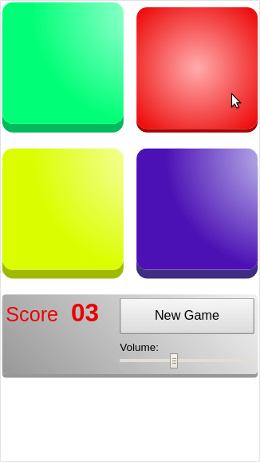

# Simon
A Simon like game coded in plain JS (ES2015), using the Web Audio API.

## Run
To test the game, first you'll need to have [nodejs](https://nodejs.org) installed and an up to date browser.

Then run:
```sh
cd <projectDirectory>
npm install
npm run server
```
## Screenshot
